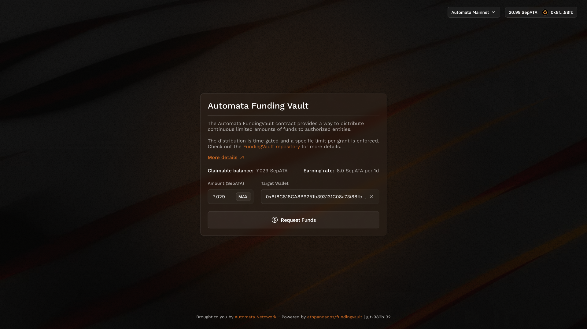

# Claimer Playbook

This playbook serves as a guide for claimers with **whitelisted wallet addresses** to receive tokens from the **FundingVault**.

Before using the FundingVault, please ensure your wallet:

- Is compatible with the Automata Mainnet
- Has a small amount of ATA as gas to claim the funds (funds can be bridged via the [Automata Bridge](https://bridge.ata.network/))

## FundingVault Website Tutorial

1. Connect your wallet
    1. Visit the FundingVault and connect your wallet.
    2. Make sure that you’re connected to the Automata Mainnet
    3. You can add this network to your wallet using [1RPC](https://www.1rpc.io/)

2. Request Funds
    1. After signing in, you can request funds (in **ATA**) to be distributed to your target wallet address
    2. The maximum amount you can claim is displayed as the claimable balance
    3. A small amount of **ATA** is required as gas to complete the claim

After signing in, you can request for funds (in ATA) to be distributed to a target wallet address.

The amount can be claimed up to the maximum claimable balance displayed on the screen. This requires a small amount of gas fees in ATA to claim the funds.

## Understanding claimable balance and earning rate

Your **claimable balance** grows over time based on your **earning rate**. The earning rate is defined as:

- Amount: How much you can earn per interval
- Interval: The time period for earning increments

Here’s an example of an earning rate: 8 ATA (amount) per 1 day (interval).

Important tip: It’s recommended to make claims at time intervals shorter than the set interval to avoid losing funds. This ensures that you always claim your maximum eligible balance.

## Scenario breakdown

1. Claim time is 21 hours after first claim: You receive **7 ATA** (based on the 8 ATA/day rate)
2. Claim time is at exactly 24 hours after the first claim: You receive the full 8 ATA
3. Claim time is 27 hours after the first claim: You still receive 8 ATA (your maximum claimable balance)
    1. Even though your balance could have reached 9 ATA if the stream continued, you lose the extra 1 ATA because the FundingVault stops streaming once you hit the maximum claimable balance.

To avoid missing out on potential earnings:

Make claims before reaching the maximum claimable balance by keeping the period between claims shorter than the interval.

This ensures you always capture the full earning rate without gaps in your claimable balance.
