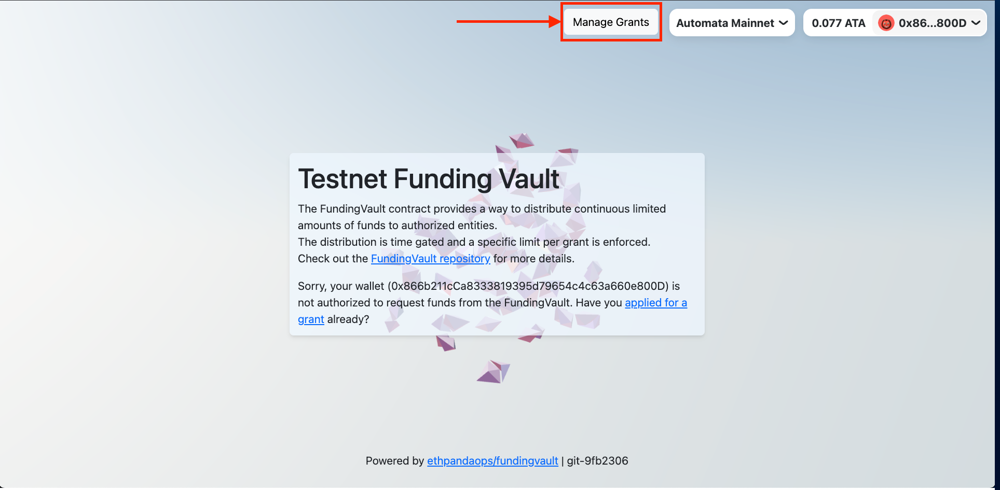
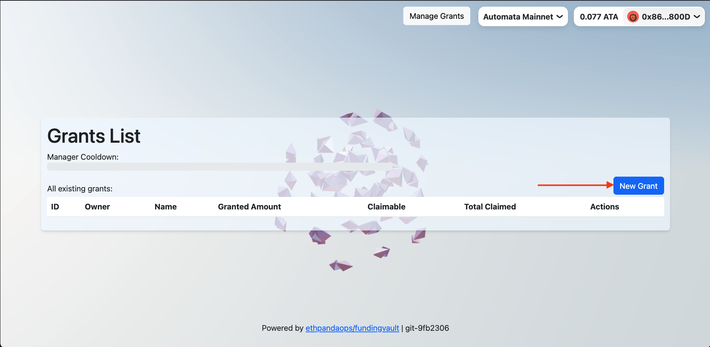
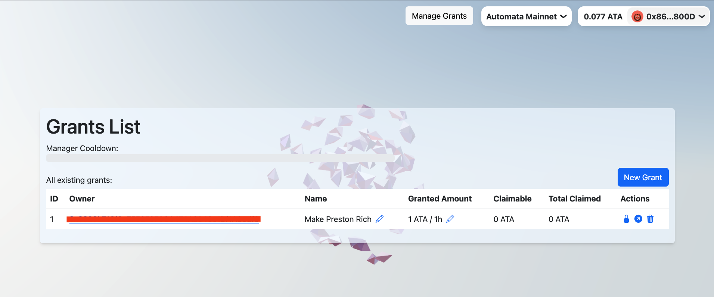
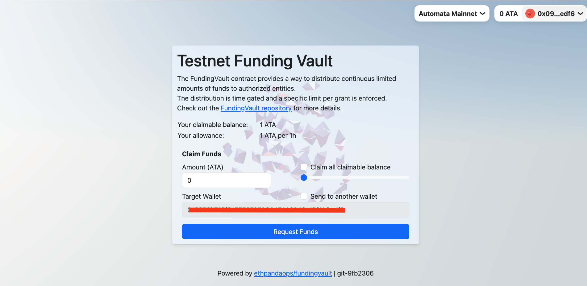
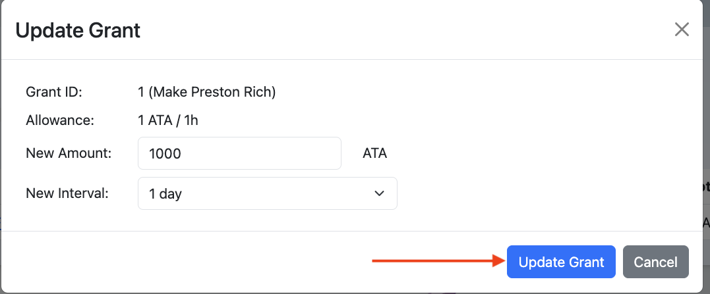
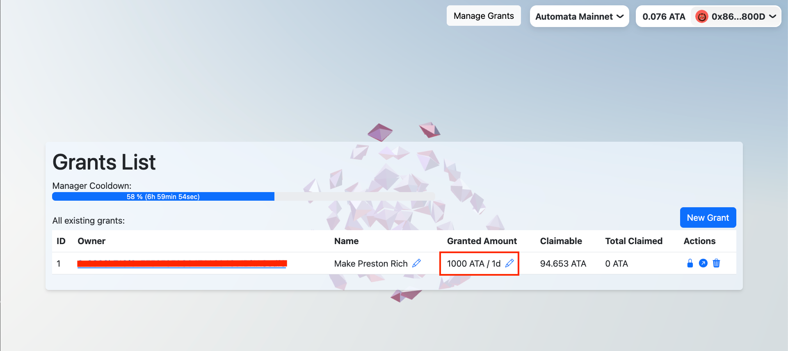
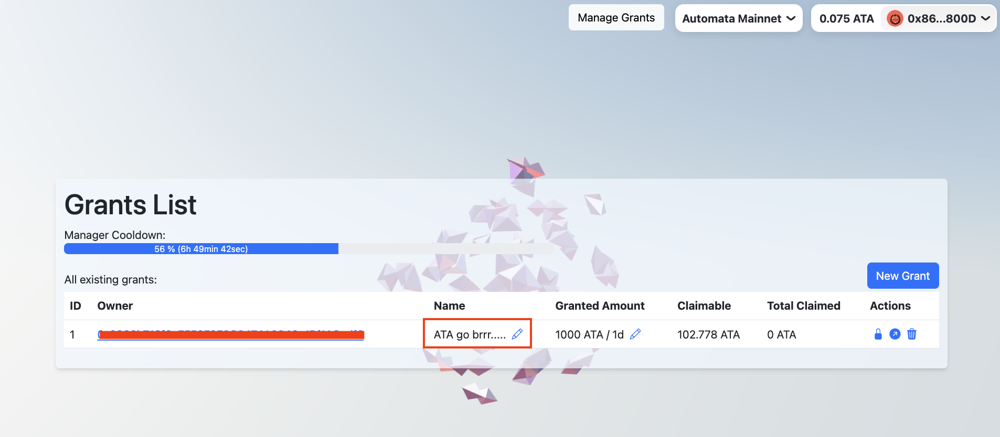
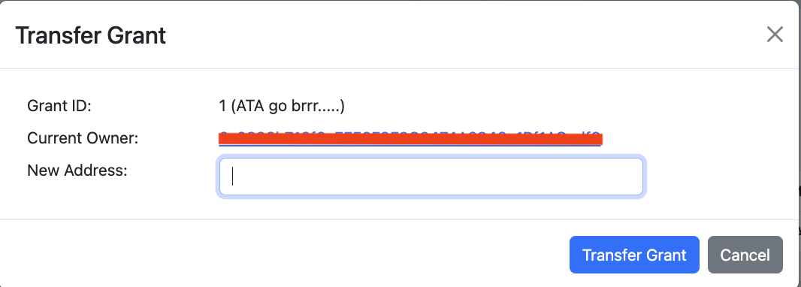

# Grant Manager Playbook

Account holders who are granted with the `GRANT_MANAGER_ROLE` should use this playbook as a reference.

Grant managers may perform the following actions:
- Create grants
- Update the amount per time period entitled to an existing grant recipient
- Rename grants
- Transfer grants from one recipient to another
- Delete grants

The next section covers the actions listed above more in-depth.

Grant managers can perform all actions above either via the website or CLI.

This playbook provides the tutorial on how you can manage grants using the UI provided by the website. To use the CLI, you may refer to the [FundingVault CLI Guide](../fundingvault/README.md).

---
## FundingVault Website Tutorial

### Wallet Configuration

When landed on the website, you must first connect to your wallet.

Make sure that you are connected to the intended network and account. Once you have done so, you should see the homescreen with the "Manage Grants" button as shown below:

Click on "Manage Grants" to see the Grants List.

The Grants List is currently empty, so let's go ahead and create one.

### Create Grant(s)

Click on "New Grant", the following prompt should appear:

> **⚠️ IMPORTANT**:
>
> Grant managers are limited to a specified amount that they can manage within a configured interval. 
>
> Currently, defaults at 100K ETH per month for each manager. This is subject to change by the Vault owner.
>
> If a grant manager has created (or updated) grants with the total amount exceeded the limit, the grant manager may need to "cooldown" before they can continue managing more grants.
>
> See [Cooldown Deep-Dive](#cooldown-deep-dive) section for more details.
>

After filling up the form, clicking on "Create Grant" should prompt your wallet to submit the transaction. A transaction hash will appear after submitting the transaction.

Close the prompt window, you should see the newly added grant in the list.

>
> **ℹ️ NOTE**:
>
> The Grants List shows ALL grants that are being actively managed and is NOT scoped to individual managers.
> In other words, grants created by other manager(s) are also visible to all managers.
>

>
> **ℹ️ NOTE**:
>
> Newly created grants will not be immediately claimable, because of a "transfer lock" put in place.  
> Transfer lock is a delay measure to avoid funds from being drained due to human errors, such as:
>
> (1) setting the wrong recipient address, 
>
> (2) setting the wrong amount, 
>
> etc.
>
> The current default transfer lock time is 10 minutes, and is subject to change by the Vault owner.
>

After the transfer lock period has passed, the user should be able to claim the entitled amount.

>
> **✅ Knowledge Check**:
> 
> TODO
>

### Update Grant(s)

Managers can modify an existing grant, which allows:

- Changing the amount per interval entitled to the recipient 

>
> **⚠️ IMPORTANT**:
>
> - If the new `amount / interval` is higher than previous, this increases the cooldown timer.
>
> - Changing `amount / interval` may also affect the total unclaimed amount of previously claimable balance. E.g. if a recipient had accumulated X claimable amount and the `amount / interval` for the grant had doubled, the recipient would instead be entitled to 2X claimable amount after the update is in effect.
>

- Changing the grant name

Continuing from the example above, let's increase the amount and change the grant name.

Click on the ✏ pencil icon under "Granted Amount", and the following prompt should appear:

After submitting the transaction, you should see the updated amount in "Granted Amount".

Similarly, you can change the grant name by clicking on the pencil icon under "Name".

### Lock Grant(s)

Manager(s) can suspend an existing grant by clicking on the 🔒 pad lock icon. This would set the claimable balance for the grant to zero.

Managers can specify the lock time in seconds in the prompt shown below:

The user shouldn't be able to claim the funds for 10 minutes.

### Transfer Grant(s)

An existing grant can either be transferred by:

(1) The recipient themselves, OR

(2) Grant managers (**⚠️ IMPORTANT**: Increases the cooldown timer)

> **ℹ️ Note**: A "transfer lock" will immediately be in effect after transferring of grants. 

A user can transfer grants by simply sending the NFT to a target address.

For grant managers, simply click on the arrow ↗ icon to initiate the transfer action.

Simply provide the target address in the prompt shown below:

### Delete Grant(s)

Grant managers can delete (which in turn, burns the NFT representing) grants, and thereby permanently disqualifies the recipient from claiming funds from the Vault. 

To delete a grant, click on the trash 🗑️ icon. Then, click "Delete Grant" to submit the transaction.

---

## Cooldown Deep-Dive

TODO